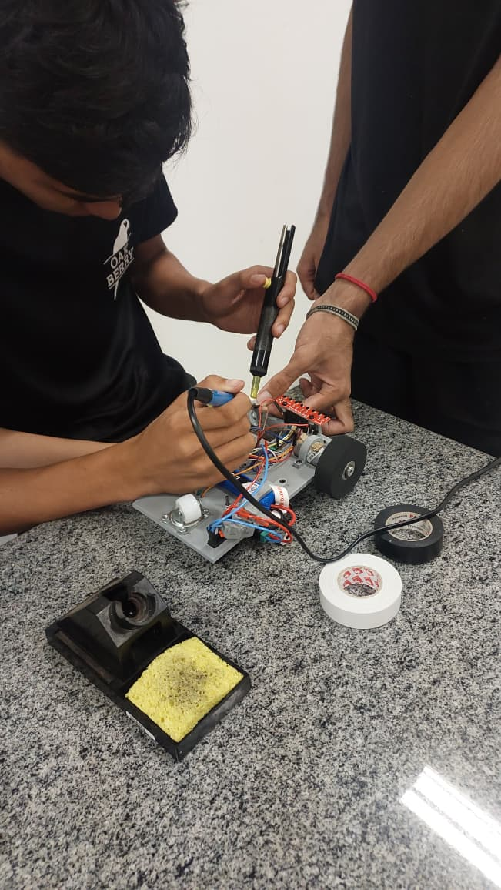
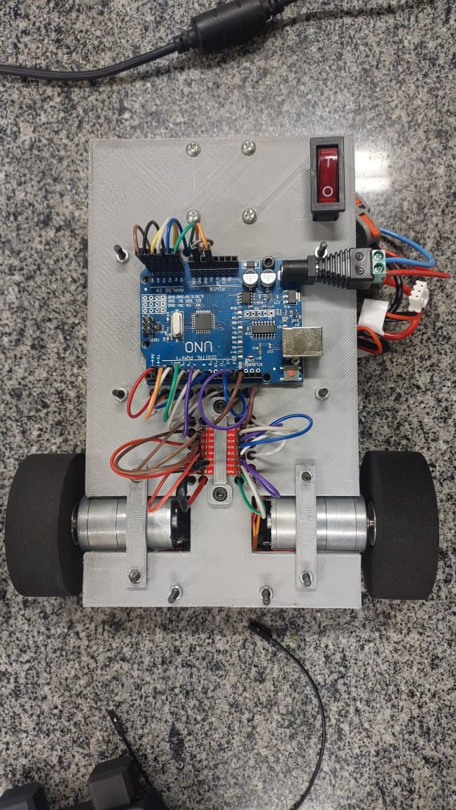
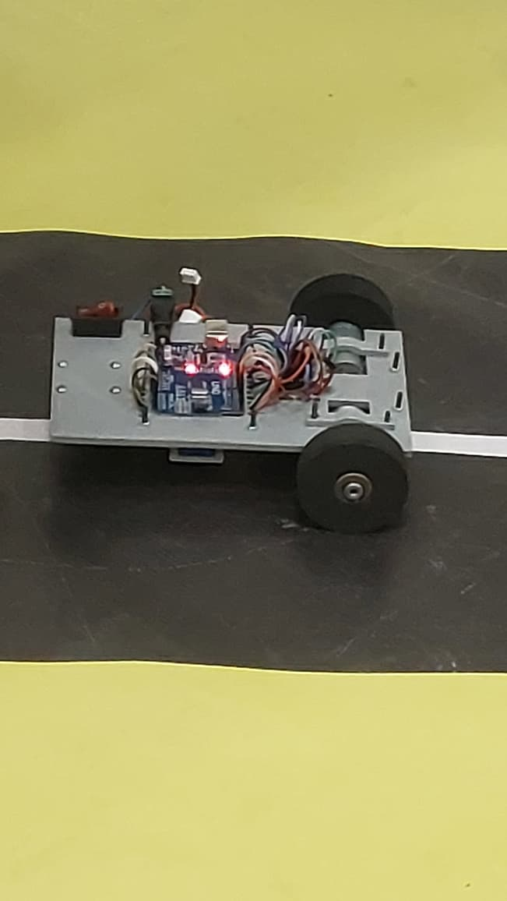
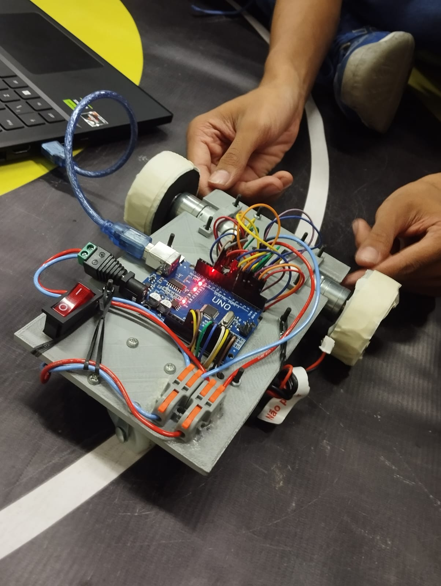

# carrinho_segue_linha
projeto de robõ seguidor de linha com arduino
## 🎥 Vídeo do funcionamento
[▶️ Ver o carrinho seguindo a linha] https://youtube.com/shorts/iI2mneNwjWw?si=47BrSdploxw0rtwp

## 📸 Imagens do projeto

### 🔧 Montagem

### 🤖 Carrinho

### 🛣️ Em funcionamento

